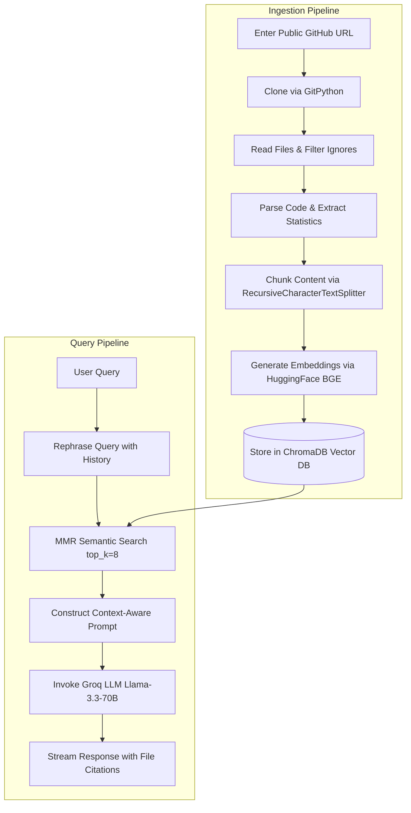

# InsightRAG
Chat with GitHub Repositories, PDFs, and YouTube Content

RepoRAG AI is a production-grade Retrieval-Augmented Generation (RAG) platform that ingests any public GitHub repository, splits and parses the code, indexes it inside a local vector database (ChromaDB), and sets up a conversational interface using LangChain and Groq LLMs.

---

## 🧬 System Architecture

The following diagram illustrates the data flow of the application during the indexing and query stages:



---

## 📁 Repository Directory Structure

```
reporag/
├── app.py                  # Main Streamlit Application UI
├── requirements.txt        # Third-party Python dependencies
├── .env                    # Local environment variables secrets
├── .env.example            # Environment variables template
│
├── src/                    # Backend modular packages
│   ├── __init__.py         # Package entrypoint
│   ├── github_loader.py    # URL parser and Git clone utilities
│   ├── repo_parser.py      # Directory walker, language mapper, and tree builder
│   ├── chunking.py         # Code/Text Recursive character splitter
│   ├── embeddings.py       # BGE-small-en-v1.5 sentence-transformers loader
│   ├── vectordb.py         # ChromaDB interface (indexing, MMR retriever, deletions)
│   ├── prompts.py          # Structured System & User prompt templates
│   ├── utils.py            # Token counter and ASCII folder tree generator
│   └── rag_chain.py        # LCEL Chat Groq streams and specific template tasks
│
├── chroma_db/              # Directory where ChromaDB indexes are persisted (created automatically)
├── repositories/           # Local folder where git repositories are cloned (created automatically)
└── docs/                   # Documentation resources
```

---

## 🚀 Getting Started

### Prerequisites
1. **Python 3.9+** installed on your machine.
2. **Git** executable installed and set in your System Environment `PATH` variables (required by GitPython).
3. **Groq API Key** (Get one from [Groq Console](https://console.groq.com/)).

### Installation Guide

1. **Clone or Open this workspace**:
   ```bash
   cd reporag
   ```

2. **Create a Virtual Environment**:
   * **Windows (PowerShell)**:
     ```powershell
     python -m venv venv
     .\venv\Scripts\Activate.ps1
     ```
   * **macOS/Linux**:
     ```bash
     python3 -m venv venv
     source venv/bin/activate
     ```

3. **Install Dependencies**:
   ```bash
   pip install --upgrade pip
   pip install -r requirements.txt
   ```

4. **Configure Environment Variables**:
   Copy `.env.example` to `.env`:
   ```bash
   cp .env.example .env
   ```
   Open `.env` and configure your API key:
   ```env
   GROQ_API_KEY=gsk_your_actual_key_here
   ```

---

## 🎮 Running the Application Locally

Start the Streamlit application server:
```bash
streamlit run app.py
```

Streamlit will automatically launch in your default web browser (typically at `http://localhost:8501`).

---

## 🛠️ Feature Modules Explanation

### 1. Ingestion & Cloning (`src/github_loader.py`)
Validates that incoming URL formats represent standard, public repositories. Clones them using a GitPython wrapper with `depth=1` to optimize bandwidth and disk usage.

### 2. Repo Parser (`src/repo_parser.py`)
Recursively traverses directories to filter files matching target programming language extensions (`.py`, `.ts`, `.js`, etc.) while filtering build artifacts like `node_modules` or `.git`. Summarizes files, folders, and language distribution.

### 3. Smart Chunking (`src/chunking.py`)
Transforms raw texts into chunks using LangChain's `RecursiveCharacterTextSplitter`. Prepends the file path and language metadata details directly to the top of each text chunk:
```text
File: src/app.py
Language: Python

[chunk code content]
```
This design prevents the LLM from losing context during semantic search.

### 4. Semantic Vectors (`src/embeddings.py` & `src/vectordb.py`)
Utilizes `BAAI/bge-small-en-v1.5` embeddings via the HuggingFace integration (run locally). Chunks are indexed into a persistent Chroma database. Retrieval uses MMR (Maximal Marginal Relevance) to retrieve diverse yet highly relevant source contexts.

### 5. Multi-Repo Conversational RAG (`src/rag_chain.py`)
Implements conversational QA pipelines:
- Integrates memory histories, rephrasing statements before search queries.
- Streams responses from Groq's Llama models.
- Auto-compiles documentation, summaries, questions, and Mermaid charts.

---

## ☁️ Deployment Instructions

### Option A: Deployment on Streamlit Community Cloud
1. Push your repository to your GitHub account.
2. Visit [Streamlit Share](https://share.streamlit.io/) and log in with your GitHub account.
3. Click **New app**, select your repository, branch, and specify `app.py` as the entrypoint path.
4. In **Advanced Settings**, add your environment variables under **Secrets**:
   ```toml
   GROQ_API_KEY = "gsk_..."
   ```
5. Click **Deploy**.

### Option B: Deploying with Docker
1. Create a `Dockerfile` in the root directory:
   ```dockerfile
   FROM python:3.10-slim

   # Install git
   RUN apt-get update && apt-get install -y git && rm -rf /var/lib/apt/lists/*

   WORKDIR /app

   COPY requirements.txt .
   RUN pip install --no-cache-dir -r requirements.txt

   COPY . .

   EXPOSE 8501

   ENTRYPOINT ["streamlit", "run", "app.py", "--server.port=8501", "--server.address=0.0.0.0"]
   ```

2. Build and run the docker image:
   ```bash
   docker build -t reporag-app .
   docker run -p 8501:8501 --env GROQ_API_KEY="gsk_..." reporag-app
   ```
